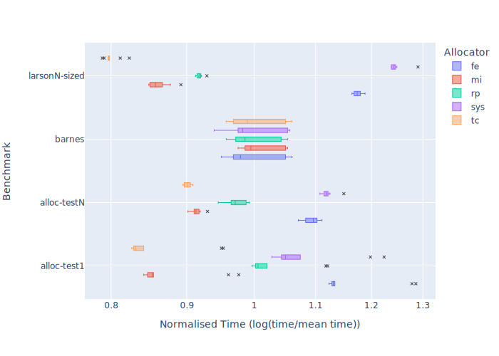
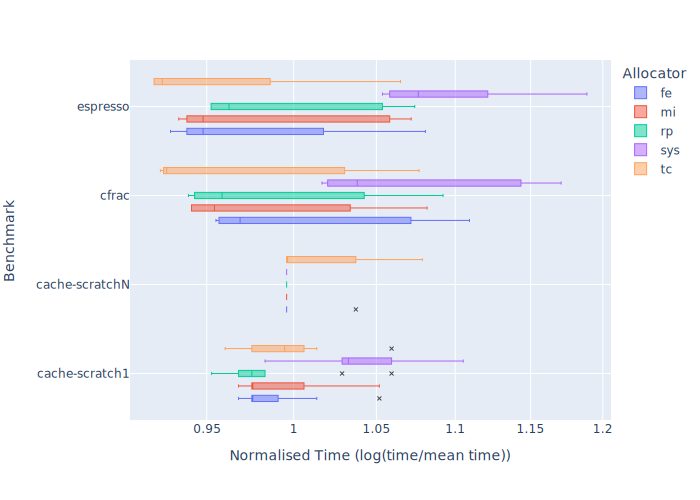
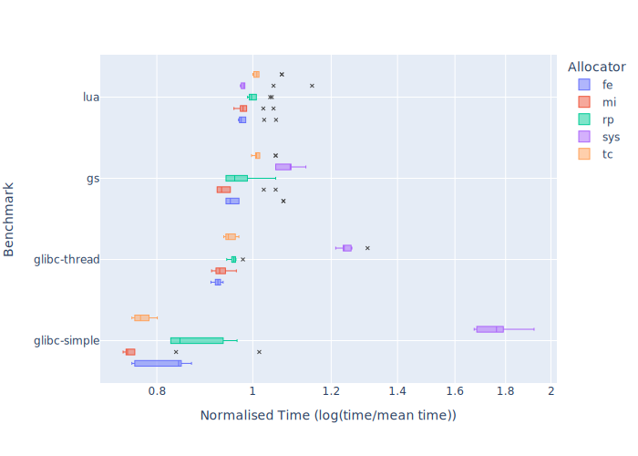
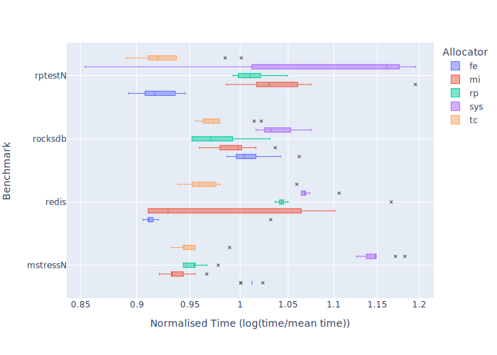
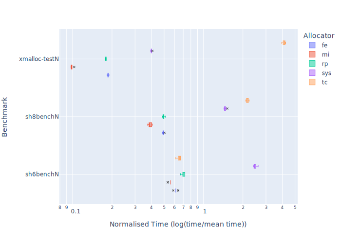
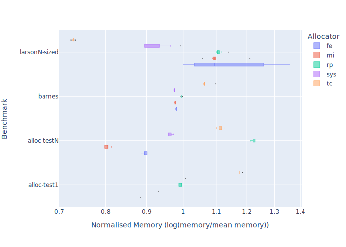
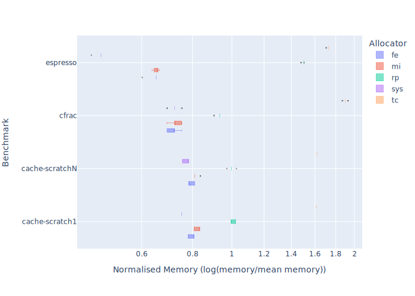
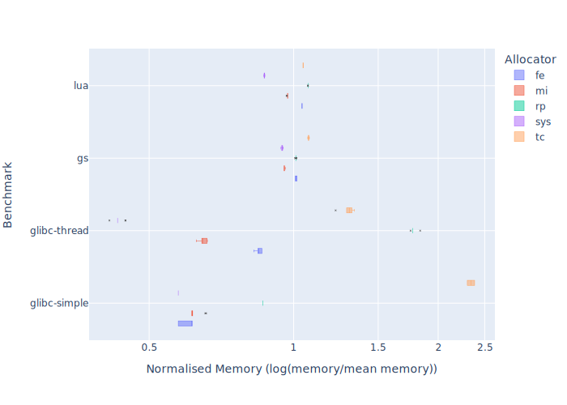
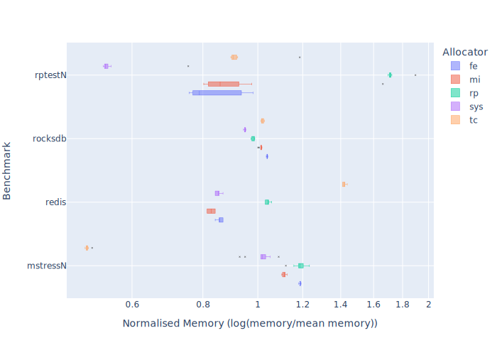
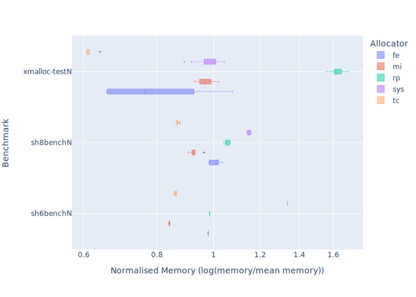

# Ferroc: A Multithread Lock-free Memory Allocator

[](https://github.com/js2xxx/ferroc/actions)
[](https://crates.io/crates/ferroc)
[](https://codecov.io/gh/js2xxx/ferroc)
[](https://docs.rs/ferroc)
[](https://github.com/js2xxx/ferroc)

Ferroc (combined from "ferrum" and "malloc") is a lock-free concurrent memory allocator written in Rust, primarily inspired by [`mimalloc`](https://github.com/microsoft/mimalloc).

This memory allocator is designed to work as fast as other mainstream memory allocators while providing flexible configurations such as embedded/bare-metal environment integrations.

## Examples

If you simply want to utilize another memory allocator, you can use Ferroc as the global allocator with default features:

```rust
use ferroc::Ferroc;

#[global_allocator]
static FERROC: Ferroc = Ferroc;

fn main() {
    // Using the global allocator API.
    let _vec = vec![10; 100];

    // Manually allocate memory.
    let layout = std::alloc::Layout::new::<u8>();
    let ptr = Ferroc.allocate(layout).unwrap();
    unsafe { Ferroc.deallocate(ptr, layout) };

    // Immediately run some delayed clean-up operations.
    Ferroc.collect(/* force */false);
}
```

If you want more control over the allocator, you can disable the default features and enable the ones you need:

```toml
ferroc = {version = "*", default-features = false, features = ["base-mmap"]}
```

```rust
#![feature(allocator_api)]
use ferroc::{
    arena::Arenas,
    heap::{Heap, Context},
    base::Mmap,
};

fn main() {
    let arenas = Arenas::new(Mmap); // `Arenas` are `Send` & `Sync`...
    let cx = Context::new(&arenas);
    let heap = Heap::new(&cx); // ...while `Context`s and `Heap`s are not.

    // Using the allocator API.
    let mut vec = Vec::new_in(&heap);
    vec.extend([1, 2, 3, 4]);
    assert_eq!(vec.iter().sum::<i32>(), 10);

    // Manually allocate memory.
    let layout = std::alloc::Layout::new::<u8>();
    let ptr = heap.allocate(layout).unwrap();
    unsafe { heap.deallocate(ptr.cast(), layout) }.unwrap();

    // Immediately run some delayed clean-up operations.
    heap.collect(/* force */false);
}
```

## Cargo Features

- Basic features: generic `Arenas`, `Context`s and `Heap`s;
- `"base-static"`: Base allocator `Static`;
- `"base-mmap"`: Base allocator `Mmap` based on os-specific virtual memory managers (`std` and `libc` required);
- `"global"`: Global allocator instantiation macros `config!` and `config_mod!` (inner thread local statics are leaked by default);
- `"libc"`: `libc` dependency (currently required by `pthread` option in `config*!` if you want a `pthread` thread-local destructor);
- `"default"`: The default global allocator `Ferroc` provided by `Mmap` and `pthread` thread-local destructor (consisting of all the features above);
- `"c"`: `fe_*` C functions for C/C++ targets and a generated C/C++ header `"ferroc.h"` in the root directory, and replacement for default allocator functions such as `malloc` if `--cfg sys_alloc` is specified;
- `"track-valgrind"`: Valgrind memory tracking support based on [`crabgrind`](https://github.com/2dav/crabgrind);
- `"finer-grained"`: Add more object size types to small bins, decreasing fragmentation but also the minimal alignment from 16 to 8, potentially leading some programs that need SIMD to fail for misalignment.

## Building process for C/C++ users

1. Download and install the latest nightly Rust toolchain:

```bash
curl --proto '=https' --tlsv1.2 -sSf https://sh.rustup.rs |\
    sh -- -y --toolchain nightly --profile minimal -c rust-src
```

2. Just `CMake` and `make` it:

```bash
mkdir target && cd target
cmake .. && make
```

3. If you want to install the library:

```bash
sudo make install
```

Common options like `--install-prefix` are supported naturally by CMake.

There are also some custom options (via `cmake -D`) you can enable:

- `FE_DEBUG`: Enable debug builds (assertions + debug infos);
- `FE_TRACK_VALGRIND`: See [`"track-valgrind"`](#cargo-features) above;
- `FE_FINER_GRAINED`: See [`"finer-grained"`](#cargo-features) above.

## Benchmarks

Using a subset of [`mimalloc-bench`](https://github.com/daanx/mimalloc-bench) for benchmarking. Running on my laptop with 16GB of RAM and an Intel i7-10750H CPU @ 2.60GHz. The process is repeated 10 times and the results are averaged and taken as logarithms.

Time consumed:







Memory consumed:







## Caveats

This crate only supports the latest nightly Rust compiler currently and utilizes many unstable features. Use it with care.

### License

Licensed under either of

* Apache License, Version 2.0 ([LICENSE-APACHE](LICENSE-APACHE))
* MIT license ([LICENSE-MIT](LICENSE-MIT))

at your option.